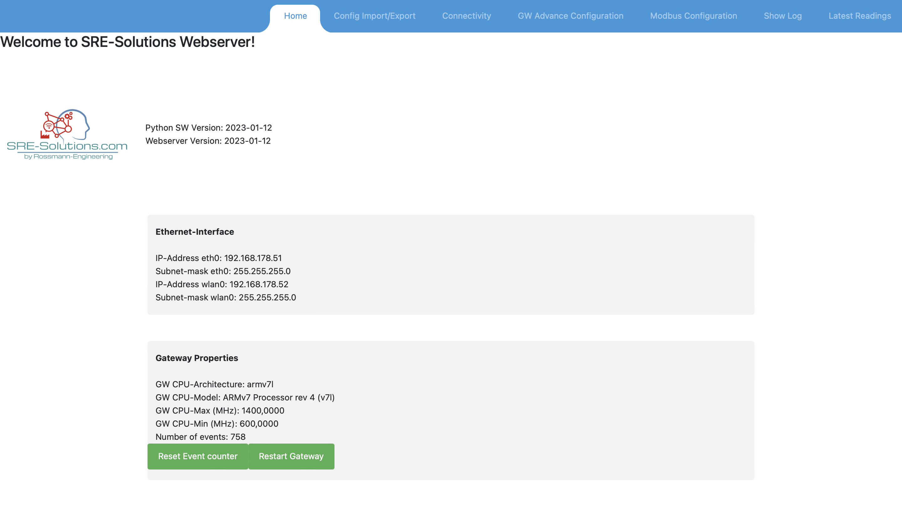
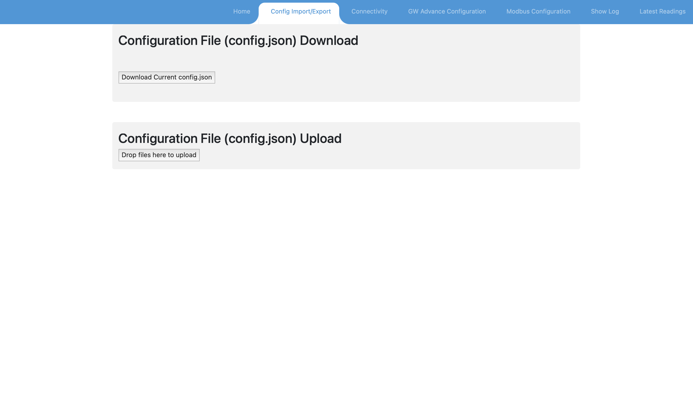

# "Wise Energy Industrial IoT Gateway" Documentation

## Table of Contents
1. [Introduction](#introduction)
2. [Linux Service](#linuxservice)
   2.1 [Install instructions](#installinstructions)
3. [Requirements](#requirements)  
4. [Test Instructions](#testistructions)
5. [config.json structure](#configjsonstructure)  
   5.1 [Read Order](#readorder)  
   5.2 [Modbus command](#modbuscommand)  
   5.3 [Devices](#devices)  
      >5.3.1 [Modbus Devices](#modbusdevices)
   
   5.4 [MQTT-Broker](#mqttbroker)  
6. [Webserver](#webserver)  
    6.1 [Main Screen](#webservermainscreen)  
    6.2 [Config Import/Export](#webserverconfigimportexport)  
    6.3 [Connectivity](#webserverconnectivity)  
    6.4 [GW Advance configuration](#webserveradvanceconfiguration)

<div id="introduction"/>

## 1. Introduction

The Industrial Gateway application is a Software written in Python which reads values from Fieldbus Devices and sends that data to a Cloud platform via MQTT.
Designed is the Application to run on a Linux Hardware, but it also runs under Windows OS and MAC OS.

The Application starts a webserver which allows the user to get informations about the current status und to change settings.

The Application is configurable using a configuration file (config.json). This file can be edited using a texteditor or the Webserver.

To start the Application the Python File "run.py" has to be executed

<div id="linuxservice"/>

## 2. Linux Service

To Run the application as a service (which starts at OS startup) the unit declaration file 'gateway' has to be added to
'etc/systemd/system/'
The content of the file as available under the "scripts" folder.

Then the following commands has to be executed:

systemctl daemon-reload  
systemctl enable gateway
systemctl start gateway

To check the Status of the Service:

systemctl status gateway


<div id="installinstructions"/>

### 2.1 installinstructions

The following instructions should give a rough guideline how to install the Gateway application on a raspberry pi

1 Update the Package list

sudo apt-get update

2 Install pip3

sudo apt-get install python3-pip

3 Install dependencies

pip3 install Flask
pip3 install pyserial
pip3 install requests
pip3 install paho-mqtt
pip3 install tornado

4 Clone git repository

git clone https://github.com/PKwemo/gtrendMonitoring.git.
The command line may ask for yut Github credentials

5 Create Linux Service (see section 2.)


<div id="requirements"/>

## 3. Requirements
- Python 3
- Dependencies listed in "requirements.txt"
  - Flask
  - pyserial
  - requests
  - paho-mqtt
  - tornado

<div id="testistructions"/>

## 4. Gateway Test instructions
- Depending on the Fieldbus, the Gateway can be tested locally.
- To Run a Modbus-TCP Server or Modbus-RTU Slave locally (for example www.EasyModbusTCP.NET), the IP-Address of the device has to be set to localhost for Modbus TCP, or a serial Bridge has to be set up for Modbus RTU
- The Server Parameter has to be set to the MQTT-Broker the Data should be send to.
- The default access credentials for the webserver are "wiseenergy" as username "123456" as password

<div id="configjsonstructure"/>

## 5. config.json structure

```json
  "readinterval": 30.0, 
  "basicinterval": 150.0, 
  "loggingmultiplier": 2,
  "loglevel": "error",
  "emailregisterlogfiles": "info@rossmann-engineering.de",
  "emailerrornotification": "info@rossmann-engineering.de",
  "emailfromaddress": "gateway@sre-solutions.com",
  "smtphost": "smtp.ionos.de",
  "smtpport": 587,
  "smtpusername": "gateway@sre-solutions.com",
  "smtppassword": "GatewayTestAccount4711!",
  "smtpenabletls": true
```
Element description:
- readinterval: The Interval data will be polled from the Fielbus devices
- basicinterval: The Interval Tags will be uploaded to the MQTT-Broker
- loggingmultiplier: The Data will be stored in a CSV-File with every Modbus request if the logging multiplier is set to "1". To keep the Amount of data small, the loggingmultiplier can be increased to save the data with every loggingmultiplier Poll.
- loglevel: can be "critical", "error", "warning", "info", "debug", "notset" - The Gateway application uses the loglevels "error" and "info" and "debug". The logentries are stored in the journal and the file "unitdatabase/logdata.txt"
- emailregisterlogfiles: E-Mail address to send the Registerlogfiles to. Tbhe Registerlogfile is created every day, and is send every midnight
- emailerrornotification: E-Mail address were to send the Notification in case on an Error to. The E-Mail message contains the Stacktrace and only one message per hour can be send
- emailfromaddress: E-Mail address of the Mailserver used to send the notifications
- smtphost: SMTP-Host of the Mailserver
- smtpport: SMTP-Port of the Mailserver
- smtpusername: SMTP-Username of the Mailserver
- smtppassword: SMTP-Password of the Mailserver
- smtpenabletls: Enable TLS

<div id="readorder"/>

###  5.1 Read Order
Contains a list of Read Orders - These are tags read via Modbus-RTU or Modbus-TCP.
The Modbus-RTU connection is mostly used. Please not that the value has to be a valid address space in the
"modbuscommand" section of the config.json
(Also used to Write Values if a command has been received)
Root Element: "readorders"

Example:
```json
    "transportid": 2,
    "serverid": [1],
    "dataarea": 3,
    "address": 3001,
    "type": 15,
    "name": "vo",
    "bits": 32,
    "multiplefactor": 1,
    "absolutethreshold": 0,
    "registerintervaltime": 1,              
    "latestreading": 0.0,
    "logmodbusdata": true,                
    "transmissionmode": "averagereading",
    "signed": false,
    "Active": false,
    "datatype": "float",
    "swapregisters": true,
    "staticvalue": 3
```

Element description:

- transportid: Transport-ID were the Tag value is read from (see Element "devices")
- serverid: List of Servers to Upload to (see Element "httpservers" or "mqttbroker")
- dataarea: Address space were the value read from ("Input Register" (Read-only), "Holding Register" (Read-Write))
- address: Register to Read (or Write in case of a Command - only Holding Registers) or Object Instance No. in case of Bacnet
- type: Only used for Axonize Servers and represents the displayed unit
- name: Tag name transferred together with the value
- bits: number of bits to use to calculate the value (16, 32 or 64) - 64 bit only for double precision floating point values
- datatype: only necessary for 32bit or 64bit float or double values. Otherwise the value will be calculated via the register value and the multiplefactor (has to match with the "bits" element - float: 32, double: 64)
    - possible values: "float" or "double"
- multiplefactor: Actually the divisor used to calculate the value value = registervalue / multiplefactor (if missing default value = 1)
- swapregisters: Information how the 32 bit values are split into 16bit Registers. If "swapregisters" is set to "true" the Registers will be swapped before connecting these Registers. If the Element is missing, the default value is "false"
- registerintervaltime: multiplicator to the "basicinterval" in which updated values are transferred
- latestreading: only to display at the webserver, contains the reading of the value at the last cycle
- logmodbusdata: Enables data storage in CSV Flle (Files /unitdatabase/csv/registerlogdata.csv)
- transmissionmode: "averagereading" or "lastreading". Averagereading, values are averaged from the Last upload until the next upload is executed
- signed: not used
- active: Enables to usage of the Readorder
- absolutethreshold: Defines the difference between the last sent value and the current value, before the value will be uploaded
- relativethreshold: threshold in percent (choose between absolutetreshold). If the deviation between the last sent value and the current value exceeds the threshold, the value will be updated.
- staticvalue: Mainly for Write orders. The Gateway will always send the static value to the Fieldbus device, regardless of the value from the MQTT-Broker

<div id="modbuscommand"/>

### 5.2 Modbus Command

Contains a list of Function codes which reads Registers from a Modbus Device

Root Element: "modbuscommand"

```json
      "functioncode": "Read Input Registers", 
      "transportid": 1, 
      "startingaddress": 73, 
      "quantity": 59
```

Element Description:  
-  functioncode: "Read Input Registers" or "Read Holding Registers".  
-  transportid: Hardware Definition from which device the Request is sent to.  
-  starting address: First Register to Read.  
-  quantity: Number of 16 bit Registers to read.  

<div id="devices"/>

### 5.3 Devices

Contains a list of device descriptions. These are used to define the hardware to read the values from
The Device description for deferent protocols looks slightly different.

Root Element: "devices"

<div id="modbusdevices"/>

#### 5.3.1 Modbus Devices
```json
      "transportid": 1,
      "type": "Modbus",
      "ipaddress": "127.0.0.1",
      "port": "502",
      "unitidentifier": 1
```

Element Description:  
- transportid: Integer Number which defines the Device in the Read Order section.  
- type: "Modbus" or "Bacnet". If the element is missing it is Modbus.  
- ipaddress: IP-Address of the Modbus device.  
- port: Port were the Modbus Server is listenening for incomming requests.  
- unitidentifier: Modbus Slave-ID.

<div id="mqttbroker"/>

### 5.4 MQTT Broker

Contains a list of Server descriptions. These are used to define the MQTT Server parameter to send the data to.

Root Element: "mqttbroker"

```json
  "name": "Test",
  "address": "sre-solutions.com",
  "port": "1885",
  "publishtopic": "v1/devices/me/telemetry",
  "accesstoken": "preAneTCuLkD705s12ZD",
  "username": "wiseenergy",
  "password": "123456",
  "serverid": 3
```
 
Element Description:

- name: Name of the MQTT-Broker definition.   
- address: Address of the MQTT Broker.   
- port: Port of the MQTT-Broker.  
- publishtopic: Topic were the data are published to
- accesstoken: accesstoken to verify the Gateway at the Broker.  
- username: username to verify the connection to the Broker.  
- password: password to verify the connection to the Broker.  
- serverid: identifies the Server. Each Readorder has to refer to the Server were the data are pushed to.  

<div id="webserver"/>

## 6. Webserver

Standard Username: wiseenergy
Standard Password: 123456  
Port: 5000  

The webserver allows to setup (nearly) all parameters within the config.json

<div id="webservermainscreen"/>

### 6.1 Main Screen



After the User and Password has been verified the Main Screen of the Webserver is shown automatically (or via the top menu "Home")

At the top if the screen nect to the Logo the Software Version is shown  
The 3G-Interface section shows the connection status of the Modem. These Information are OS-specific for Linux only
The Gateway Properties section shows the Hardware of the Gateway. These Information are OS-specific for Linux only

<div id="webserverconfigimportexport"/>

### 6.2 Config Import/Export



The "Config Import/Export" tab allows the user to download the current configuration (config.json) as well as to upload a new one by drag and drop. Make sure that the uploaded file is a valid config.json. A Gateway reset is required after a new config.json has been uploaded. 

<div id="webserverconnectivity"/>

### 6.3 Connectivity


The Connectivity Tab provides Ingormation about the connection Status of the Modem connection and the Zerotier VPN Status. For test purposes AT-Commands can be send manually to the modem. The Response is displayed underneath the Input field.

<div id="webserveradvanceconfiguration"/>

### 6.4 GW Advance configuration

The Gateway Advance configuration Tab allows to edit the Parameters of the config.json and to create new entries for each section. For a detailed description about the elements please see the config.json section.


